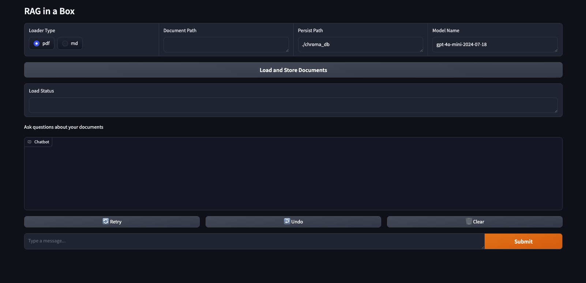

# RAG-in-a-box

<p align="center">
  
</p>


<p align="center">
  <em>Run RAG (Retreival Augment Generation) for any documents!</em>
</p>


Hey there! 👋 RAG-in-a-box is your go-to tool for quickly setting up Retrieval Augmented Generation (RAG) on your docs. It's perfect for when you're tired of uploading docs to chatgpt or want everything to be saved locally.

- 📚 Handles PDFs and Markdown files
- 🤖 Works with OpenAI and Ollama models
- 🖥️ Easy-to-use interface s/o Gradio
- 💻 CLI for you command-line lovers


## Prerequisites

1. Python 3.10 or higher
2. pip or rye package manager


### Installation

Choose one of the following methods:

- Using pip:
  ```
  pip install -r requirements.lock
  ```

- Using rye:
  ```
  rye sync
  ```

### API Keys

- For OpenAI models: Set the `OPENAI_API_KEY` environment variable with your OpenAI API key.
- For Ollama models: Ensure Ollama is installed and running on your system.


# Using the Gradio Interface

`python3 src/rag_in_a_box/interface.py`
<p align="center">
  
</p>


# Using the CLI

To use RAG-in-a-box from the command line, you can utilize the `main.py` script. Here’s how you can get started:

1. **Basic Usage:**
   ```
   python3 src/rag_in_a_box/main.py --path <path_to_your_documents>
   ```

   Replace `<path_to_your_documents>` with the path to the directory containing your PDF or Markdown files.

2. **Specify Document Loader Type:**
   By default, the script assumes you are loading PDF documents. If you want to load Markdown files, use the `--loader_type` argument:
   ```
   python3 src/rag_in_a_box/main.py --loader_type md --path <path_to_your_documents>
   ```

3. **Persisting the Vector Database:**
   You can specify a custom path to persist the vector database using the `--persist_path` argument:
   ```
   python3 src/rag_in_a_box/main.py --path <path_to_your_documents> --persist_path <path_to_persist_db>
   ```

4. **Choosing the Model:**
   The script supports both OpenAI and Ollama models. You can specify the model to use with the `--model` argument:
   ```
   python3 src/rag_in_a_box/main.py --path <path_to_your_documents> --model <model_name>
   ```

5. **Interactive Q&A:**
   Once the documents are loaded and stored, the script enters an interactive Q&A loop. Simply type your questions, and the system will provide answers based on the loaded documents. Type `quit` to exit the loop.

Example command:
   ```
   python3 src/rag_in_a_box/main.py --loader_type pdf --path ./docs --persist_path ./chroma_db --model gpt-4o-mini-2024-07-18
   ```

This command loads PDF documents from the `./docs` directory, stores them in the `./chroma_db` vector database, and uses the `gpt-4o-mini-2024-07-18` model for Q&A.


